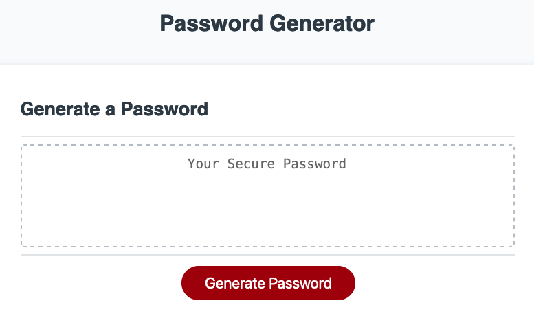

# Password-Generator

This is a password generator that allows the user to specify the length and character types of their desired password. It includes four character types: special characters, numeric characters, lowercase characters, and uppercase characters.

## Getting Started

1. Click the "Generate Password" button.
2. When prompted, enter the desired length of your passwor (must be between 10 and 64 characters).
3. When prompted, select which character types you would like to include in your password.
4. The generated password will be displayed on the screen.

## Functionality

When the "Generate Password" button is clicked, it will trigger the generatePassword function. This function will first call the getPasswordOptions function, which prompts the user for their desired password length and character types. If the user does not select at least one character type, they will be alerted and the getPasswordOptions function will be called again.

Once the password options have been determined, the generatePassword function will create an array of character types to include in the password. It will then generate a password by randomly selecting one character from each of the selected character types and joining them together. The generated password will be displayed on the screen.

The getRandom function is used to select a random element from an array.

## Deployment

https://aloosli.github.io/password-generator-app/